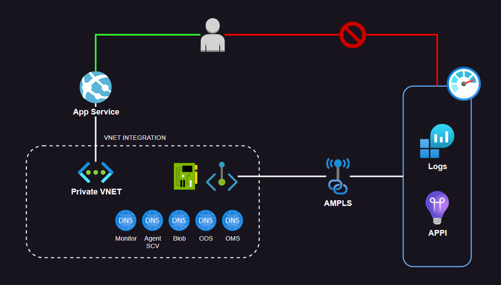

# Azure Monitor - Private Link Scope (AMPLS)

Logging and instrumentation with Monitor services network isolation using Private Link.

This service connection allow an application to send logs, telemetry, and other data, to Azure Monitor via a private connection.

It is possible to control `send data` and `query` public connectivity separately.



## Running on the cloud

Create the resources:

```sh
terraform init
terraform apply -auto-approve
```

Run the script to build and push the docker image to ACR:

```
bash app/acrBuildPush.sh
```

Once AppSrv pulls and runs the container, call the application endpoint `/monitor` to check metrics and logs being sent to Azure Monitor via a private connection.

## Local development

To test the Java application locally, create the Monitor resources:

```sh
az deployment sub create \
  --location brazilsouth \
  --template-file dev/main.bicep \
  --parameters rgLocation=brazilsouth
```

Get the the APPI connection string:

```sh
az monitor app-insights component show --app 'appi-myjavaapp' -g 'rg-myjavaapp' --query 'connectionString' -o tsv
```

Set it as an environment variable:

```sh
export APPLICATIONINSIGHTS_CONNECTION_STRING='<Your Connection String>'
```

In the `app` directory, download the latest release of the agent: 

```
curl -L -o applicationinsights-agent-3.4.14.jar https://github.com/microsoft/ApplicationInsights-Java/releases/download/3.4.14/applicationinsights-agent-3.4.14.jar
```

Setup the `MAVEN_OPTS` variable:

```
export MAVEN_OPTS=-javaagent:applicationinsights-agent-3.4.14.jar
```

Run the application:

```sh
./mvnw spring-boot:run
```
